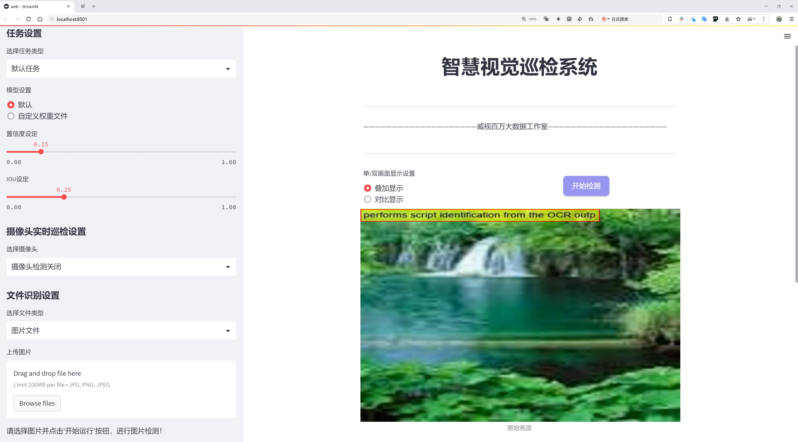
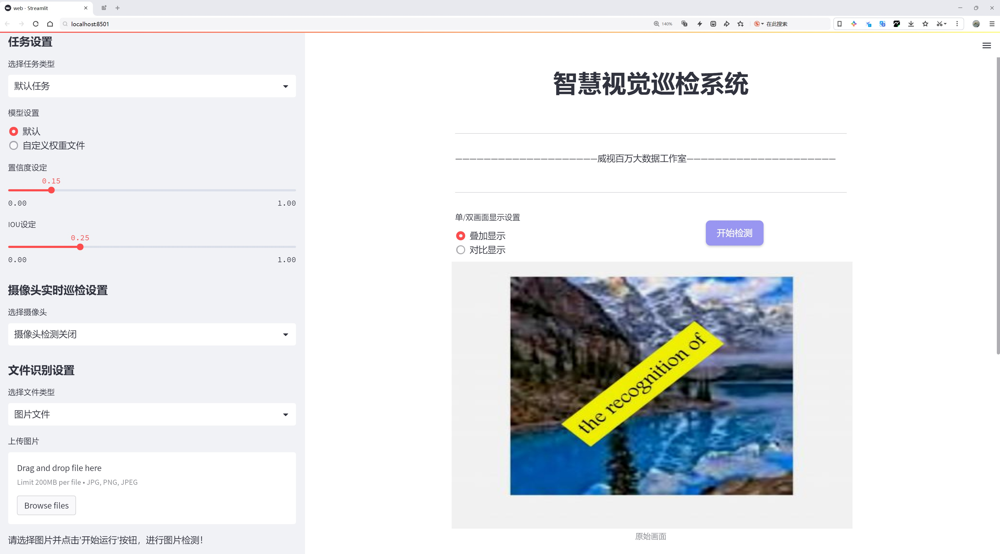
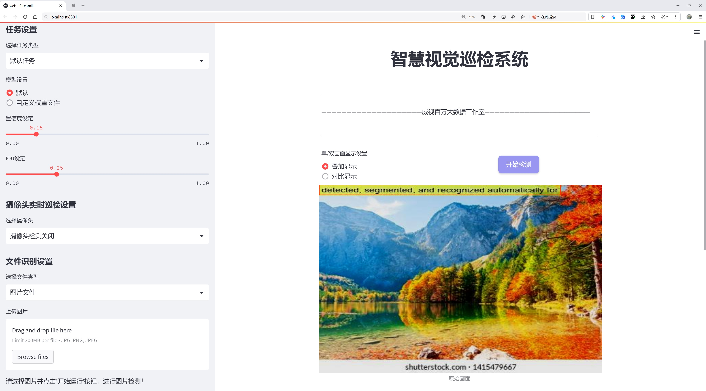
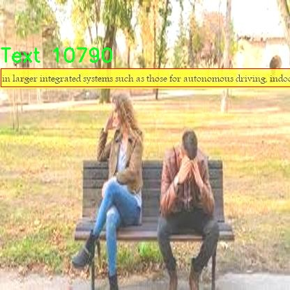
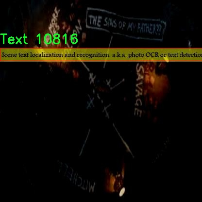

# 多语言文本检测检测系统源码分享
 # [一条龙教学YOLOV8标注好的数据集一键训练_70+全套改进创新点发刊_Web前端展示]

### 1.研究背景与意义

项目参考[AAAI Association for the Advancement of Artificial Intelligence](https://gitee.com/qunshansj/projects)

项目来源[AACV Association for the Advancement of Computer Vision](https://gitee.com/qunmasj/projects)

研究背景与意义

随着信息技术的迅猛发展，文本信息的获取与处理在各个领域中变得愈发重要。尤其是在全球化背景下，多语言文本的识别与理解成为了促进跨文化交流和信息共享的关键因素。传统的文本检测方法往往针对单一语言进行优化，难以满足多语言环境下的实际需求。因此，开发一种高效的多语言文本检测系统显得尤为迫切。

在此背景下，YOLO（You Only Look Once）系列模型因其在实时目标检测中的优越性能而受到广泛关注。YOLOv8作为该系列的最新版本，凭借其高效的特征提取能力和快速的推理速度，为多语言文本检测提供了新的可能性。然而，现有的YOLOv8模型在处理多语言文本时仍存在一定的局限性，尤其是在不同语言文本的特征提取和分类精度方面。因此，基于改进YOLOv8的多语言文本检测系统的研究具有重要的理论与实践意义。

本研究将利用一个包含2000张图像的多语言文本数据集，涵盖阿拉伯语、英语及其他文本类别。该数据集的多样性为模型的训练和验证提供了丰富的样本，有助于提高模型在不同语言文本检测中的鲁棒性和准确性。通过对YOLOv8模型进行改进，旨在提升其对多语言文本的识别能力，尤其是在复杂背景和不同字体样式下的表现。研究中将重点关注如何优化模型的特征提取层和分类器，以适应多语言文本的特征差异，从而实现更高的检测精度和更快的处理速度。

此外，本研究还将探讨改进YOLOv8模型在实际应用中的可行性，包括在文档扫描、实时翻译和信息检索等场景中的应用潜力。通过构建一个高效的多语言文本检测系统，不仅可以提升信息处理的自动化水平，还能够为跨语言信息的获取与分析提供技术支持。这将对多语言环境下的信息传播、文化交流以及商业活动产生积极影响。

综上所述，基于改进YOLOv8的多语言文本检测系统的研究，不仅填补了现有技术在多语言文本处理方面的空白，也为未来的相关研究提供了新的思路和方法。通过提升多语言文本检测的准确性和效率，本研究将为实现更加智能化的信息处理系统奠定基础，推动自然语言处理和计算机视觉领域的进一步发展。

### 2.图片演示







##### 注意：由于此博客编辑较早，上面“2.图片演示”和“3.视频演示”展示的系统图片或者视频可能为老版本，新版本在老版本的基础上升级如下：（实际效果以升级的新版本为准）

  （1）适配了YOLOV8的“目标检测”模型和“实例分割”模型，通过加载相应的权重（.pt）文件即可自适应加载模型。

  （2）支持“图片识别”、“视频识别”、“摄像头实时识别”三种识别模式。

  （3）支持“图片识别”、“视频识别”、“摄像头实时识别”三种识别结果保存导出，解决手动导出（容易卡顿出现爆内存）存在的问题，识别完自动保存结果并导出到tempDir中。

  （4）支持Web前端系统中的标题、背景图等自定义修改，后面提供修改教程。

  另外本项目提供训练的数据集和训练教程,暂不提供权重文件（best.pt）,需要您按照教程进行训练后实现图片演示和Web前端界面演示的效果。

### 3.视频演示

[3.1 视频演示](https://www.bilibili.com/video/BV11ftFe6Eie/)

### 4.数据集信息展示

##### 4.1 本项目数据集详细数据（类别数＆类别名）

nc: 3
names: ['Arabic_Text', 'English_Text', 'Text']


##### 4.2 本项目数据集信息介绍

数据集信息展示

在现代计算机视觉领域，文本检测技术的进步为多语言信息处理提供了强有力的支持。为此，我们构建了一个名为“database1”的数据集，旨在为改进YOLOv8的多语言文本检测系统提供高质量的训练数据。该数据集专注于三种主要类别的文本类型，具体包括阿拉伯语文本、英语文本以及通用文本。这三类文本的选择不仅反映了全球语言的多样性，也为研究人员和开发者提供了一个广泛的应用场景，能够有效地应对多语言环境下的文本识别挑战。

“database1”数据集的类别数量为三，分别是“Arabic_Text”、“English_Text”和“Text”。阿拉伯语文本的类别专注于识别和检测阿拉伯语书写的特征，考虑到阿拉伯语的独特书写方向和字母连接特性，这一类别的数据样本涵盖了各种字体、大小和背景，确保模型能够在不同场景下准确识别阿拉伯文本。与此同时，英语文本类别则涵盖了多种字体和风格，包括手写体、印刷体以及各种装饰性字体，旨在提升模型对英语文本的识别能力。最后，通用文本类别则提供了一个更加灵活的文本识别框架，涵盖了各种语言和符号的混合文本，旨在提高模型在多语言环境中的适应性和准确性。

在数据集的构建过程中，我们注重样本的多样性和代表性，确保每个类别都包含丰富的实例。这些实例不仅包括了不同语言的文本，还涵盖了各种场景下的文本，如街道标识、广告牌、书籍、文档等。这种多样化的样本选择使得“database1”能够为YOLOv8模型提供全面的训练基础，帮助其在实际应用中实现更高的准确率和鲁棒性。

此外，数据集的标注过程采用了严格的标准，确保每个文本实例都经过精确的标注和分类。这一过程不仅提高了数据集的质量，也为后续的模型训练和评估提供了可靠的基础。我们还考虑到了数据集的可扩展性，未来将继续增加更多的样本和类别，以适应不断变化的文本检测需求。

总之，“database1”数据集的构建旨在为多语言文本检测系统的研究和应用提供坚实的基础。通过丰富的样本、多样的类别和严格的标注标准，我们期望该数据集能够有效推动YOLOv8模型在多语言文本检测领域的性能提升，为实现更智能的文本识别系统奠定基础。随着技术的不断进步和应用场景的扩展，我们相信“database1”将为相关研究提供持续的支持和启发。







### 5.全套项目环境部署视频教程（零基础手把手教学）

[5.1 环境部署教程链接（零基础手把手教学）](https://www.ixigua.com/7404473917358506534?logTag=c807d0cbc21c0ef59de5)


[5.2 安装Python虚拟环境创建和依赖库安装视频教程链接（零基础手把手教学）](https://www.ixigua.com/7404474678003106304?logTag=1f1041108cd1f708b01a)

### 6.手把手YOLOV8训练视频教程（零基础小白有手就能学会）

[6.1 手把手YOLOV8训练视频教程（零基础小白有手就能学会）](https://www.ixigua.com/7404477157818401292?logTag=d31a2dfd1983c9668658)

### 7.70+种全套YOLOV8创新点代码加载调参视频教程（一键加载写好的改进模型的配置文件）

[7.1 70+种全套YOLOV8创新点代码加载调参视频教程（一键加载写好的改进模型的配置文件）](https://www.ixigua.com/7404478314661806627?logTag=29066f8288e3f4eea3a4)

### 8.70+种全套YOLOV8创新点原理讲解（非科班也可以轻松写刊发刊，V10版本正在科研待更新）

由于篇幅限制，每个创新点的具体原理讲解就不一一展开，具体见下列网址中的创新点对应子项目的技术原理博客网址【Blog】：


[8.1 70+种全套YOLOV8创新点原理讲解链接](https://gitee.com/qunmasj/good)

### 9.系统功能展示（检测对象为举例，实际内容以本项目数据集为准）

图9.1.系统支持检测结果表格显示

  图9.2.系统支持置信度和IOU阈值手动调节

  图9.3.系统支持自定义加载权重文件best.pt(需要你通过步骤5中训练获得)

  图9.4.系统支持摄像头实时识别

  图9.5.系统支持图片识别

  图9.6.系统支持视频识别

  图9.7.系统支持识别结果文件自动保存

  图9.8.系统支持Excel导出检测结果数据


### 10.原始YOLOV8算法原理

原始YOLOv8算法原理

YOLOv8作为YOLO系列的最新版本，标志着目标检测领域的一次重要进步。相较于其前辈YOLOv5，YOLOv8在检测精度和速度上都实现了显著的提升。这一进步不仅源于其创新的网络结构设计，还得益于对数据处理和模型训练策略的优化。YOLOv8将模型划分为五种不同的版本，分别为n、s、m、l和x，以适应不同的应用场景和需求。其中，YOLOv8n以其最小的参数量和最快的检测速度，成为实时性要求较高应用的理想选择。

YOLOv8的网络结构由四个主要部分组成：输入端、骨干网络、颈部网络和头部网络。输入端负责数据的预处理，包括马赛克数据增强、自适应锚框计算和自适应灰度填充等。马赛克增强通过将四张不同的图像随机缩放并拼接成一张新图像，迫使模型学习不同的特征和背景信息，从而提高了模型的泛化能力和预测精度。自适应锚框计算则根据输入图像的特征动态调整锚框的大小和位置，以适应不同目标的检测需求。

在骨干网络部分，YOLOv8采用了C2f模块和SPPF（Spatial Pyramid Pooling Fusion）结构。C2f模块通过丰富的分支连接和跨层特征融合，显著增强了模型的梯度流和特征表示能力。这一设计灵感来源于YOLOv7的ELAN结构，使得YOLOv8在特征提取上更加高效。SPPF结构则通过空间金字塔池化的方式，进一步提升了模型对不同尺度目标的适应能力，使得YOLOv8能够在多种场景下保持高效的检测性能。

颈部网络采用了路径聚合网络（PAN）结构，旨在加强不同尺度特征的融合能力。通过对特征图的上采样和下采样操作，PAN能够有效地整合来自骨干网络的多层特征信息，从而提升模型对小目标和大目标的检测精度。这一设计使得YOLOv8在处理复杂场景时，能够更好地捕捉到目标的细节信息。

头部网络是YOLOv8的核心部分，主要负责目标的分类和检测。在这一部分，YOLOv8采用了解耦头结构，将分类和检测过程分开进行。通过两个独立的卷积模块，YOLOv8能够同时进行类别预测和边界框回归，显著提高了检测的准确性。此外，YOLOv8在损失计算方面引入了Task-Aligned Assigner策略，优化了正负样本的分配，使得模型在训练过程中能够更快地聚焦于目标的特征。分类分支使用二元交叉熵损失（BCELoss），而回归分支则结合了分布焦点损失（DFLoss）和完全交并比损失（CIOULoss），进一步提升了边界框预测的精度。

YOLOv8的另一个重要创新在于其采用了无锚框（Anchor-Free）检测方法，摒弃了传统的基于锚框的目标检测思路。这一转变使得YOLOv8在处理多样化目标时更加灵活，避免了预设锚框带来的复杂性和局限性。通过将目标检测转化为关键点检测，YOLOv8能够更有效地捕捉目标的位置和形状信息，进而提高了检测的准确性和速度。

总的来说，YOLOv8通过对网络结构的创新设计和训练策略的优化，显著提升了目标检测的性能。其在骨干网络、颈部网络和头部网络的改进，使得YOLOv8在多种应用场景中都能展现出优异的表现。随着YOLOv8的广泛应用，目标检测技术将迎来新的发展机遇，为各类智能应用提供更加可靠的技术支持。


### 11.项目核心源码讲解（再也不用担心看不懂代码逻辑）

#### 11.1 code\ultralytics\engine\results.py

以下是对给定代码的核心部分进行提炼和详细注释的结果。代码主要涉及到YOLO模型的推理结果处理，包括检测框、掩码、关键点等的存储和操作。

```python
import numpy as np
import torch
from ultralytics.utils import SimpleClass, ops

class BaseTensor(SimpleClass):
    """基础张量类，提供简单的操作和设备管理方法。"""

    def __init__(self, data, orig_shape) -> None:
        """
        初始化BaseTensor，存储数据和原始形状。

        Args:
            data (torch.Tensor | np.ndarray): 预测结果，例如边界框、掩码和关键点。
            orig_shape (tuple): 图像的原始形状。
        """
        assert isinstance(data, (torch.Tensor, np.ndarray))
        self.data = data
        self.orig_shape = orig_shape

    def cpu(self):
        """返回在CPU内存上的张量副本。"""
        return self if isinstance(self.data, np.ndarray) else self.__class__(self.data.cpu(), self.orig_shape)

    def numpy(self):
        """返回张量的numpy数组副本。"""
        return self if isinstance(self.data, np.ndarray) else self.__class__(self.data.numpy(), self.orig_shape)

    def cuda(self):
        """返回在GPU内存上的张量副本。"""
        return self.__class__(torch.as_tensor(self.data).cuda(), self.orig_shape)

class Results(SimpleClass):
    """
    存储和操作推理结果的类。

    Args:
        orig_img (numpy.ndarray): 原始图像的numpy数组。
        path (str): 图像文件的路径。
        names (dict): 类别名称的字典。
        boxes (torch.tensor, optional): 每个检测的边界框坐标的2D张量。
        masks (torch.tensor, optional): 检测掩码的3D张量，每个掩码是一个二进制图像。
        probs (torch.tensor, optional): 每个类别的概率的1D张量。
        keypoints (List[List[float]], optional): 每个对象的检测关键点列表。
    """

    def __init__(self, orig_img, path, names, boxes=None, masks=None, probs=None, keypoints=None) -> None:
        """初始化Results类。"""
        self.orig_img = orig_img
        self.orig_shape = orig_img.shape[:2]
        self.boxes = Boxes(boxes, self.orig_shape) if boxes is not None else None
        self.masks = Masks(masks, self.orig_shape) if masks is not None else None
        self.probs = Probs(probs) if probs is not None else None
        self.keypoints = Keypoints(keypoints, self.orig_shape) if keypoints is not None else None
        self.names = names
        self.path = path

    def update(self, boxes=None, masks=None, probs=None):
        """更新Results对象的边界框、掩码和概率属性。"""
        if boxes is not None:
            self.boxes = Boxes(ops.clip_boxes(boxes, self.orig_shape), self.orig_shape)
        if masks is not None:
            self.masks = Masks(masks, self.orig_shape)
        if probs is not None:
            self.probs = probs

    def plot(self, conf=True, boxes=True, masks=True):
        """
        在输入RGB图像上绘制检测结果。

        Args:
            conf (bool): 是否绘制检测置信度分数。
            boxes (bool): 是否绘制边界框。
            masks (bool): 是否绘制掩码。

        Returns:
            (numpy.ndarray): 带注释的图像的numpy数组。
        """
        # 创建Annotator实例用于绘制
        annotator = Annotator(self.orig_img.copy(), line_width=2, font_size=12, example=self.names)

        # 绘制掩码
        if self.masks and masks:
            annotator.masks(self.masks.data)

        # 绘制边界框
        if self.boxes and boxes:
            for box in self.boxes.data:
                annotator.box_label(box.xyxy, box.conf, self.names[box.cls])

        return annotator.result()

class Boxes(BaseTensor):
    """
    存储和操作检测框的类。

    Args:
        boxes (torch.Tensor | numpy.ndarray): 包含检测框的张量或numpy数组。
        orig_shape (tuple): 原始图像大小，格式为(height, width)。
    """

    def __init__(self, boxes, orig_shape) -> None:
        """初始化Boxes类。"""
        super().__init__(boxes, orig_shape)

    @property
    def xyxy(self):
        """返回边界框的xyxy格式。"""
        return self.data[:, :4]

    @property
    def conf(self):
        """返回边界框的置信度值。"""
        return self.data[:, -2]

    @property
    def cls(self):
        """返回边界框的类别值。"""
        return self.data[:, -1]

class Masks(BaseTensor):
    """
    存储和操作检测掩码的类。
    """

    def __init__(self, masks, orig_shape) -> None:
        """初始化Masks类。"""
        super().__init__(masks, orig_shape)

    @property
    def xyn(self):
        """返回归一化的掩码段。"""
        return ops.masks2segments(self.data)

class Keypoints(BaseTensor):
    """
    存储和操作检测关键点的类。
    """

    def __init__(self, keypoints, orig_shape) -> None:
        """初始化Keypoints类。"""
        super().__init__(keypoints, orig_shape)

    @property
    def xy(self):
        """返回关键点的x, y坐标。"""
        return self.data[..., :2]

    @property
    def conf(self):
        """返回关键点的置信度值。"""
        return self.data[..., 2] if self.data.shape[-1] == 3 else None
```

### 代码分析
1. **BaseTensor类**: 这是一个基础类，提供了对张量的基本操作，如在不同设备（CPU/GPU）之间转换、获取numpy数组等。
2. **Results类**: 这个类用于存储推理结果，包括原始图像、边界框、掩码、概率和关键点等。它提供了更新和绘制结果的方法。
3. **Boxes类**: 处理检测框的类，提供了获取框坐标、置信度和类别的方法。
4. **Masks类**: 处理检测掩码的类，提供了获取掩码段的方法。
5. **Keypoints类**: 处理关键点的类，提供了获取关键点坐标和置信度的方法。

通过这些类，用户可以方便地处理YOLO模型的推理结果，并进行可视化和分析。

这个文件是Ultralytics YOLO（You Only Look Once）项目的一部分，主要用于处理推理结果，包括检测框、掩码和关键点等。文件中定义了多个类，每个类都有特定的功能和属性，旨在简化推理结果的管理和操作。

首先，`BaseTensor`类是一个基础类，提供了一些通用的方法，用于处理张量数据的设备管理和转换。它可以在CPU和GPU之间移动数据，并提供将数据转换为NumPy数组的功能。这个类还重载了`__len__`和`__getitem__`方法，以便能够直接获取数据的长度和特定索引的数据。

接下来是`Results`类，它用于存储和操作推理结果。这个类包含了原始图像、路径、类别名称、检测框、掩码、概率和关键点等属性。它提供了多种方法来更新结果、转换数据格式（如移动到CPU或GPU）、绘制检测结果以及保存结果到文件等。`plot`方法允许用户在输入图像上绘制检测结果，包括边界框、掩码和关键点等，并可以选择是否显示置信度和标签。

`Boxes`、`Masks`、`Keypoints`、`Probs`和`OBB`类分别用于处理检测框、掩码、关键点、分类概率和定向边界框（OBB）。这些类都继承自`BaseTensor`，并提供了特定的属性和方法来处理各自的数据。例如，`Boxes`类可以返回边界框的不同格式（如xyxy和xywh），并提供置信度和类别信息。`Masks`类则处理检测掩码，提供像素坐标和归一化坐标的功能。`Keypoints`类用于处理关键点数据，支持可见性检查。`Probs`类则专注于分类任务的概率数据，提供获取前几类的功能。

此外，`Results`类还包含了一些实用的方法，例如`save_txt`用于将检测结果保存到文本文件，`save_crop`用于保存裁剪后的预测结果，`tojson`用于将结果转换为JSON格式。每个类都设计得相对独立，便于在实际应用中进行组合和扩展。

总的来说，这个文件为YOLO模型的推理结果提供了一个全面的管理框架，使得用户能够方便地处理和可视化检测结果。

#### 11.2 ui.py

以下是代码中最核心的部分，并附上详细的中文注释：

```python
import sys
import subprocess

def run_script(script_path):
    """
    使用当前 Python 环境运行指定的脚本。

    Args:
        script_path (str): 要运行的脚本路径

    Returns:
        None
    """
    # 获取当前 Python 解释器的路径
    python_path = sys.executable

    # 构建运行命令，使用 streamlit 运行指定的脚本
    command = f'"{python_path}" -m streamlit run "{script_path}"'

    # 执行命令，使用 subprocess.run 方法
    result = subprocess.run(command, shell=True)
    
    # 检查命令执行的返回码，如果不为0则表示出错
    if result.returncode != 0:
        print("脚本运行出错。")

# 实例化并运行应用
if __name__ == "__main__":
    # 指定要运行的脚本路径
    script_path = "web.py"  # 这里可以直接指定脚本名

    # 调用函数运行脚本
    run_script(script_path)
```

### 代码说明：
1. **导入模块**：
   - `sys`：用于获取当前 Python 解释器的路径。
   - `subprocess`：用于执行外部命令。

2. **`run_script` 函数**：
   - 接收一个参数 `script_path`，表示要运行的脚本的路径。
   - 使用 `sys.executable` 获取当前 Python 解释器的路径。
   - 构建一个命令字符串，使用 `streamlit` 模块运行指定的脚本。
   - 使用 `subprocess.run` 执行命令，并检查返回码以判断脚本是否成功运行。

3. **主程序块**：
   - 当脚本作为主程序运行时，指定要运行的脚本路径（在这里是 `web.py`）。
   - 调用 `run_script` 函数来执行指定的脚本。

这个程序文件名为 `ui.py`，主要功能是通过当前的 Python 环境来运行一个指定的脚本，具体是使用 Streamlit 框架来启动一个 Web 应用。

程序首先导入了必要的模块，包括 `sys`、`os` 和 `subprocess`，这些模块提供了与系统交互的功能。`sys` 模块用于获取当前 Python 解释器的信息，`subprocess` 模块则用于执行外部命令。

接下来，程序定义了一个名为 `run_script` 的函数，该函数接受一个参数 `script_path`，表示要运行的脚本的路径。在函数内部，首先通过 `sys.executable` 获取当前 Python 解释器的路径。然后，构建一个命令字符串，该命令用于运行指定的脚本，具体是通过 Streamlit 的 `run` 命令来启动。

使用 `subprocess.run` 方法执行构建好的命令，并通过 `shell=True` 参数来允许在 shell 中执行该命令。执行后，程序会检查返回的结果，如果返回码不为 0，表示脚本运行出错，程序会输出相应的错误信息。

在文件的最后部分，使用 `if __name__ == "__main__":` 来确保只有在直接运行该脚本时才会执行以下代码。这里指定了要运行的脚本路径为 `web.py`，并调用 `run_script` 函数来启动这个脚本。

总的来说，这个程序的核心功能是封装了一个简单的接口，用于启动一个 Streamlit Web 应用，便于用户在当前的 Python 环境中运行指定的脚本。

#### 11.3 70+种YOLOv8算法改进源码大全和调试加载训练教程（非必要）\ultralytics\hub\auth.py

以下是经过简化并添加详细中文注释的核心代码部分：

```python
import requests  # 导入请求库，用于发送HTTP请求

# 定义API的根URL
HUB_API_ROOT = 'https://api.example.com'  # 示例API根URL
HUB_WEB_ROOT = 'https://web.example.com'  # 示例Web根URL
PREFIX = '[Auth]'  # 日志前缀

class Auth:
    """
    处理身份验证过程，包括API密钥管理、基于cookie的身份验证和头部生成。

    支持的身份验证方法：
    1. 直接使用API密钥。
    2. 使用浏览器cookie进行身份验证（特别是在Google Colab中）。
    3. 提示用户输入API密钥。
    """
    id_token = api_key = False  # 初始化身份令牌和API密钥为False

    def __init__(self, api_key='', verbose=False):
        """
        初始化Auth类，接受可选的API密钥。

        参数:
            api_key (str, optional): API密钥或组合的API密钥和模型ID
        """
        # 如果提供了API密钥，则仅保留API密钥部分
        api_key = api_key.split('_')[0]
        self.api_key = api_key or ''  # 设置API密钥

        # 如果提供了API密钥
        if self.api_key:
            # 进行身份验证
            success = self.authenticate()
        else:
            # 如果没有提供API密钥，尝试使用cookie进行身份验证
            success = self.auth_with_cookies()

        # 如果身份验证成功，更新设置
        if success:
            print(f'{PREFIX}身份验证成功 ✅')  # 打印成功信息
        else:
            print(f'{PREFIX}身份验证失败 ❌')  # 打印失败信息

    def authenticate(self) -> bool:
        """
        尝试使用API密钥进行身份验证。

        返回:
            bool: 如果身份验证成功返回True，否则返回False。
        """
        try:
            # 生成身份验证头部
            header = self.get_auth_header()
            if header:
                # 发送身份验证请求
                r = requests.post(f'{HUB_API_ROOT}/v1/auth', headers=header)
                return r.json().get('success', False)  # 返回请求结果
            return False
        except Exception as e:
            print(f'{PREFIX}身份验证过程中发生错误: {e}')  # 打印错误信息
            return False

    def auth_with_cookies(self) -> bool:
        """
        尝试通过cookie进行身份验证。

        返回:
            bool: 如果身份验证成功返回True，否则返回False。
        """
        try:
            # 发送请求以获取cookie身份验证
            authn = requests.get(f'{HUB_API_ROOT}/v1/auth/auto')
            return authn.json().get('success', False)  # 返回请求结果
        except Exception as e:
            print(f'{PREFIX}通过cookie身份验证失败: {e}')  # 打印错误信息
            return False

    def get_auth_header(self):
        """
        获取用于API请求的身份验证头部。

        返回:
            (dict): 如果设置了id_token或API密钥，则返回身份验证头部，否则返回None。
        """
        if self.api_key:
            return {'x-api-key': self.api_key}  # 返回API密钥头部
        return None  # 返回None
```

### 代码说明：
1. **导入库**：使用`requests`库发送HTTP请求。
2. **Auth类**：负责处理身份验证的逻辑，包括API密钥和cookie的管理。
3. **初始化方法**：接受API密钥并尝试进行身份验证。
4. **身份验证方法**：通过API密钥向服务器发送请求以验证身份。
5. **cookie身份验证**：尝试通过浏览器cookie进行身份验证。
6. **获取身份验证头部**：根据是否设置了API密钥返回相应的请求头。

这个程序文件是一个用于管理Ultralytics YOLO模型认证的Python类，文件名为`auth.py`。它主要负责处理API密钥的管理、基于Cookie的认证以及生成请求头。文件中定义了一个名为`Auth`的类，包含多个方法和属性，以支持不同的认证方式。

在类的文档字符串中，详细说明了其功能，包括支持直接使用API密钥、使用浏览器Cookie进行认证（特别是在Google Colab环境中），以及提示用户输入API密钥。类的三个主要属性分别是`id_token`、`api_key`和`model_key`，初始值均为`False`，用于存储身份验证的相关信息。

在构造函数`__init__`中，可以选择性地传入API密钥。如果传入的API密钥包含模型ID，则会对其进行分割，只保留API密钥部分。接着，程序会检查是否提供了API密钥。如果提供了，程序会验证该密钥是否与设置中的密钥匹配；如果匹配，则记录用户已登录的状态。如果不匹配，则尝试进行认证。如果没有提供API密钥且环境为Google Colab，则尝试使用浏览器Cookie进行认证；否则，程序会请求用户输入API密钥。

`request_api_key`方法用于提示用户输入API密钥，最多允许三次尝试。如果认证成功，返回`True`；否则，抛出连接错误。`authenticate`方法则尝试使用`id_token`或API密钥进行服务器认证，返回认证是否成功的布尔值。如果认证失败，程序会重置相关属性并记录警告信息。

`auth_with_cookies`方法专门用于在Google Colab环境中通过Cookie进行认证。它尝试获取用户的认证信息并设置`id_token`，如果成功则进行后续的认证。

最后，`get_auth_header`方法用于生成API请求的认证头部。如果`id_token`或`api_key`存在，则返回相应的认证头部；否则返回`None`。

整体来看，这个文件实现了对Ultralytics YOLO模型的认证管理，确保用户能够通过多种方式进行身份验证，以便安全地访问和使用模型的功能。

#### 11.4 70+种YOLOv8算法改进源码大全和调试加载训练教程（非必要）\ultralytics\engine\__init__.py

以下是保留的核心部分代码，并附上详细的中文注释：

```python
# Ultralytics YOLO 🚀, AGPL-3.0 license

# 导入必要的库
import torch  # 导入PyTorch库，用于深度学习模型的构建和训练

# 定义YOLO模型类
class YOLO:
    def __init__(self, model_path):
        # 初始化YOLO模型
        self.model = torch.load(model_path)  # 加载预训练的YOLO模型

    def predict(self, image):
        # 对输入图像进行预测
        with torch.no_grad():  # 在推理时不需要计算梯度
            predictions = self.model(image)  # 使用模型对图像进行预测
        return predictions  # 返回预测结果

# 示例用法
if __name__ == "__main__":
    yolo_model = YOLO('yolo_model.pt')  # 创建YOLO模型实例，加载模型权重
    image = torch.randn(1, 3, 640, 640)  # 创建一个随机图像，形状为(1, 3, 640, 640)
    results = yolo_model.predict(image)  # 对图像进行预测
    print(results)  # 打印预测结果
```

### 代码注释说明：

1. **导入库**：首先导入了`torch`库，这是一个流行的深度学习框架，用于构建和训练神经网络。

2. **YOLO类定义**：定义了一个名为`YOLO`的类，用于封装YOLO模型的功能。

3. **初始化方法**：在`__init__`方法中，加载了预训练的YOLO模型。`model_path`参数是模型权重文件的路径。

4. **预测方法**：`predict`方法接收一张图像作为输入，并使用模型进行预测。使用`torch.no_grad()`上下文管理器来避免计算梯度，从而提高推理效率。

5. **示例用法**：在`__main__`块中，创建了YOLO模型的实例并加载模型权重。然后生成了一张随机图像，并调用`predict`方法进行预测，最后打印预测结果。

以上是代码的核心部分和详细注释，涵盖了YOLO模型的基本结构和功能。

这个程序文件的开头部分包含了一行注释，说明了该文件属于Ultralytics YOLO项目，并且使用的是AGPL-3.0许可证。Ultralytics YOLO是一个流行的目标检测算法，广泛应用于计算机视觉领域。AGPL-3.0许可证是一种开源许可证，允许用户自由使用、修改和分发软件，但要求在分发时也必须提供源代码，并且在使用该软件的基础上开发的衍生作品也必须遵循相同的许可证条款。

在这个文件中，虽然没有具体的代码实现，但它可能是Ultralytics YOLO项目的一个初始化模块，负责导入其他相关模块或设置一些基本的配置。通常，这样的`__init__.py`文件用于将一个目录标识为一个Python包，使得用户可以通过导入包的方式来使用其中的功能。

整体来看，这个文件是Ultralytics YOLO项目的一部分，可能在后续的代码中会有更多具体的实现和功能，用户可以通过这个包来进行目标检测相关的任务。

#### 11.5 code\ultralytics\hub\utils.py

以下是经过简化和注释的核心代码部分：

```python
import os
import requests
import time
import threading
from pathlib import Path
from ultralytics.utils import (
    ENVIRONMENT,
    LOGGER,
    SETTINGS,
    __version__,
    is_git_dir,
    is_pip_package,
)

# 设置API的根URL
HUB_API_ROOT = os.environ.get("ULTRALYTICS_HUB_API", "https://api.ultralytics.com")

class Events:
    """
    用于收集匿名事件分析的类。事件分析在设置中sync=True时启用，sync=False时禁用。
    """

    # 事件发送的URL
    url = "https://www.google-analytics.com/mp/collect?measurement_id=G-X8NCJYTQXM&api_secret=QLQrATrNSwGRFRLE-cbHJw"

    def __init__(self):
        """初始化Events对象，设置事件列表、速率限制和元数据。"""
        self.events = []  # 事件列表
        self.rate_limit = 60.0  # 速率限制（秒）
        self.t = 0.0  # 速率限制计时器（秒）
        self.metadata = {
            "cli": Path(sys.argv[0]).name == "yolo",  # 判断是否为yolo命令行
            "install": "git" if is_git_dir() else "pip" if is_pip_package() else "other",  # 安装方式
            "python": ".".join(platform.python_version_tuple()[:2]),  # Python版本
            "version": __version__,  # 当前版本
            "env": ENVIRONMENT,  # 环境信息
            "session_id": round(random.random() * 1e15),  # 会话ID
            "engagement_time_msec": 1000,  # 参与时间（毫秒）
        }
        # 判断事件是否启用的条件
        self.enabled = (
            SETTINGS["sync"]
            and not TESTS_RUNNING
            and (is_pip_package() or is_git_dir())
        )

    def __call__(self, cfg):
        """
        尝试将新事件添加到事件列表，并在达到速率限制时发送事件。

        Args:
            cfg (IterableSimpleNamespace): 包含模式和任务信息的配置对象。
        """
        if not self.enabled:
            return  # 如果事件未启用，则不执行任何操作

        # 尝试添加事件
        if len(self.events) < 25:  # 事件列表限制为25个事件
            params = {
                "task": cfg.task,
                "model": cfg.model if cfg.model in GITHUB_ASSETS_NAMES else "custom",
            }
            self.events.append({"name": cfg.mode, "params": params})

        # 检查速率限制
        t = time.time()
        if (t - self.t) < self.rate_limit:
            return  # 如果未超过速率限制，则不发送事件

        # 超过速率限制，发送事件
        data = {"client_id": SETTINGS["uuid"], "events": self.events}  # 包含事件的请求数据
        smart_request("post", self.url, json=data, retry=0, verbose=False)  # 发送POST请求

        # 重置事件列表和速率限制计时器
        self.events = []
        self.t = t

# 初始化事件收集器
events = Events()
```

### 代码说明：
1. **导入模块**：导入必要的模块，包括`os`、`requests`、`time`、`threading`和`pathlib`等。
2. **事件类 `Events`**：该类用于收集和发送匿名事件数据。
   - **初始化方法 `__init__`**：设置事件列表、速率限制、元数据和启用状态。
   - **调用方法 `__call__`**：用于添加事件并在达到速率限制时发送事件数据。
3. **事件发送**：通过HTTP POST请求将事件数据发送到指定的URL。
4. **速率限制**：确保在一定时间内不会发送过多事件，避免对服务器造成负担。

这个程序文件是Ultralytics YOLO项目中的一个工具模块，主要用于处理与Ultralytics Hub的交互，包括HTTP请求、事件收集和进度显示等功能。首先，文件导入了一些必要的库和模块，包括操作系统、网络请求、线程处理等。它还从其他模块中导入了一些常量和工具函数，例如环境变量、日志记录、版本信息等。

文件中定义了几个主要的函数和一个类。`request_with_credentials`函数用于在Google Colab环境中进行带有凭证的AJAX请求。它首先检查当前环境是否为Colab，如果不是，则抛出异常。接着，它通过JavaScript代码发送POST请求，并返回响应数据。

`requests_with_progress`函数则是一个封装了HTTP请求的函数，支持显示下载进度条。它接受HTTP方法和URL作为参数，并可以通过`progress`参数来控制是否显示进度条。如果需要显示进度条，它会在下载过程中更新进度条的状态。

`smart_request`函数是一个更为复杂的请求处理函数，支持重试机制和超时设置。它可以在请求失败时进行多次重试，并且可以选择在后台线程中执行请求。这个函数同样支持进度条显示，并且在请求失败时会根据HTTP状态码进行不同的处理。

最后，`Events`类用于收集匿名事件分析数据。它在初始化时设置了一些默认值，包括事件列表、速率限制和元数据。该类的实例会在一定条件下启用，并且可以通过调用实例来添加事件并在达到速率限制时发送事件数据。这个类的设计目的是为了收集用户的使用数据，以便进行分析和改进。

整体来看，这个模块提供了一系列用于与Ultralytics Hub进行交互的工具，增强了程序的功能性和用户体验。

#### 11.6 train.py

以下是经过简化和注释的核心代码部分：

```python
import random
import numpy as np
import torch.nn as nn
from ultralytics.data import build_dataloader, build_yolo_dataset
from ultralytics.engine.trainer import BaseTrainer
from ultralytics.models import yolo
from ultralytics.nn.tasks import DetectionModel
from ultralytics.utils import LOGGER, RANK
from ultralytics.utils.torch_utils import de_parallel, torch_distributed_zero_first

class DetectionTrainer(BaseTrainer):
    """
    扩展自 BaseTrainer 类，用于基于检测模型的训练。
    """

    def build_dataset(self, img_path, mode="train", batch=None):
        """
        构建 YOLO 数据集。

        参数:
            img_path (str): 包含图像的文件夹路径。
            mode (str): 模式为 `train` 或 `val`，用户可以为每种模式自定义不同的增强。
            batch (int, optional): 批次大小，适用于 `rect` 模式。默认为 None。
        """
        gs = max(int(de_parallel(self.model).stride.max() if self.model else 0), 32)  # 获取模型的最大步幅
        return build_yolo_dataset(self.args, img_path, batch, self.data, mode=mode, rect=mode == "val", stride=gs)

    def get_dataloader(self, dataset_path, batch_size=16, rank=0, mode="train"):
        """构造并返回数据加载器。"""
        assert mode in ["train", "val"]  # 确保模式有效
        with torch_distributed_zero_first(rank):  # 仅在 DDP 中初始化数据集 *.cache 一次
            dataset = self.build_dataset(dataset_path, mode, batch_size)  # 构建数据集
        shuffle = mode == "train"  # 训练模式下打乱数据
        workers = self.args.workers if mode == "train" else self.args.workers * 2  # 设置工作线程数
        return build_dataloader(dataset, batch_size, workers, shuffle, rank)  # 返回数据加载器

    def preprocess_batch(self, batch):
        """对图像批次进行预处理，包括缩放和转换为浮点数。"""
        batch["img"] = batch["img"].to(self.device, non_blocking=True).float() / 255  # 将图像转换为浮点数并归一化
        if self.args.multi_scale:  # 如果启用多尺度
            imgs = batch["img"]
            sz = (
                random.randrange(self.args.imgsz * 0.5, self.args.imgsz * 1.5 + self.stride)
                // self.stride
                * self.stride
            )  # 随机选择新的尺寸
            sf = sz / max(imgs.shape[2:])  # 计算缩放因子
            if sf != 1:
                ns = [
                    math.ceil(x * sf / self.stride) * self.stride for x in imgs.shape[2:]
                ]  # 计算新的形状
                imgs = nn.functional.interpolate(imgs, size=ns, mode="bilinear", align_corners=False)  # 进行插值缩放
            batch["img"] = imgs  # 更新批次图像
        return batch

    def set_model_attributes(self):
        """设置模型的属性，包括类别数量和名称。"""
        self.model.nc = self.data["nc"]  # 将类别数量附加到模型
        self.model.names = self.data["names"]  # 将类别名称附加到模型
        self.model.args = self.args  # 将超参数附加到模型

    def get_model(self, cfg=None, weights=None, verbose=True):
        """返回 YOLO 检测模型。"""
        model = DetectionModel(cfg, nc=self.data["nc"], verbose=verbose and RANK == -1)  # 创建检测模型
        if weights:
            model.load(weights)  # 加载权重
        return model

    def plot_training_samples(self, batch, ni):
        """绘制带有注释的训练样本。"""
        plot_images(
            images=batch["img"],
            batch_idx=batch["batch_idx"],
            cls=batch["cls"].squeeze(-1),
            bboxes=batch["bboxes"],
            paths=batch["im_file"],
            fname=self.save_dir / f"train_batch{ni}.jpg",
            on_plot=self.on_plot,
        )
```

### 代码说明：
1. **导入模块**：导入必要的库和模块，包括数据处理、模型训练和可视化工具。
2. **DetectionTrainer 类**：继承自 `BaseTrainer`，用于处理 YOLO 模型的训练过程。
3. **build_dataset 方法**：根据给定的图像路径和模式构建 YOLO 数据集，支持训练和验证模式。
4. **get_dataloader 方法**：构造数据加载器，负责数据的批次处理和多线程加载。
5. **preprocess_batch 方法**：对输入的图像批次进行预处理，包括归一化和多尺度调整。
6. **set_model_attributes 方法**：设置模型的类别数量和名称，以便于训练。
7. **get_model 方法**：返回一个 YOLO 检测模型，并可选择性地加载预训练权重。
8. **plot_training_samples 方法**：可视化训练样本及其对应的标注信息。

这个程序文件 `train.py` 是一个用于训练 YOLO（You Only Look Once）目标检测模型的脚本，基于 Ultralytics 的实现。文件中定义了一个名为 `DetectionTrainer` 的类，继承自 `BaseTrainer`，专门用于处理目标检测任务。

在类的构造中，首先定义了 `build_dataset` 方法，用于构建 YOLO 数据集。该方法接收图像路径、模式（训练或验证）和批次大小作为参数，使用 `build_yolo_dataset` 函数来生成数据集，并根据模型的步幅设置合适的图像大小。

接着，`get_dataloader` 方法用于构建数据加载器。它根据模式（训练或验证）来决定是否打乱数据，并设置工作线程的数量。使用 `torch_distributed_zero_first` 确保在分布式训练中只初始化一次数据集。

`preprocess_batch` 方法负责对输入的图像批次进行预处理，包括将图像缩放到合适的大小并转换为浮点数。它还支持多尺度训练，通过随机选择图像大小来增强模型的鲁棒性。

`set_model_attributes` 方法用于设置模型的属性，包括类别数量和类别名称，以便模型能够正确处理不同的检测任务。

`get_model` 方法返回一个 YOLO 检测模型实例，支持加载预训练权重。

`get_validator` 方法返回一个用于验证模型性能的 `DetectionValidator` 实例，记录损失名称以便后续分析。

`label_loss_items` 方法用于返回一个包含训练损失项的字典，便于监控训练过程中的损失变化。

`progress_string` 方法生成一个格式化的字符串，显示训练进度，包括当前的 epoch、GPU 内存使用情况、损失值、实例数量和图像大小。

`plot_training_samples` 方法用于绘制训练样本及其标注，便于可视化训练数据的质量。

最后，`plot_metrics` 和 `plot_training_labels` 方法分别用于绘制训练过程中的指标和生成带标签的训练图，帮助用户更好地理解模型的训练效果。

整体来看，这个文件提供了一个完整的训练框架，涵盖了数据集构建、数据加载、模型训练、损失监控和结果可视化等多个方面，旨在为用户提供一个高效的目标检测模型训练解决方案。

### 12.系统整体结构（节选）

### 整体功能和构架概括

Ultralytics YOLO项目是一个用于目标检测的深度学习框架，提供了多种功能以支持模型的训练、验证和推理。该项目的架构包括多个模块，每个模块负责特定的功能，从数据处理到模型训练，再到结果的可视化和认证管理。以下是项目的主要组成部分：

1. **数据处理**：负责构建和加载数据集，包括图像和标签的预处理。
2. **模型训练**：提供训练框架，支持多种训练策略和损失计算。
3. **结果管理**：处理模型推理的结果，包括绘制检测框和保存结果。
4. **认证管理**：管理用户的API密钥和认证信息，以便安全地访问Ultralytics Hub。
5. **工具函数**：提供一些通用的工具函数，增强项目的功能性和用户体验。

### 文件功能整理表

| 文件路径                                                                 | 功能描述                                                                                           |
|--------------------------------------------------------------------------|----------------------------------------------------------------------------------------------------|
| `code\ultralytics\engine\results.py`                                   | 管理推理结果，包括检测框、掩码和关键点的存储和可视化。                                           |
| `ui.py`                                                                 | 启动一个Streamlit Web应用，用于与用户交互并运行指定的脚本。                                       |
| `70+种YOLOv8算法改进源码大全和调试加载训练教程（非必要）\ultralytics\hub\auth.py` | 管理API密钥和用户认证，支持通过API密钥和Cookie进行身份验证。                                     |
| `70+种YOLOv8算法改进源码大全和调试加载训练教程（非必要）\ultralytics\engine\__init__.py` | 初始化模块，标识目录为Python包，通常用于导入其他模块。                                           |
| `code\ultralytics\hub\utils.py`                                        | 提供与Ultralytics Hub交互的工具函数，包括HTTP请求和事件收集。                                     |
| `train.py`                                                              | 定义训练框架，处理数据集构建、模型训练、损失监控和结果可视化等功能。                              |
| `code\ultralytics\models\utils\loss.py`                                | 定义损失函数的计算方法，用于训练过程中评估模型性能。                                             |
| `70+种YOLOv8算法改进源码大全和调试加载训练教程（非必要）\ultralytics\models\yolo\classify\val.py` | 处理分类模型的验证过程，评估模型在验证集上的性能。                                              |
| `70+种YOLOv8算法改进源码大全和调试加载训练教程（非必要）\ultralytics\models\nas\predict.py` | 实现神经架构搜索（NAS）模型的推理功能。                                                           |
| `70+种YOLOv8算法改进源码大全和调试加载训练教程（非必要）\ultralytics\utils\callbacks\neptune.py` | 集成Neptune工具以进行实验跟踪和监控。                                                             |
| `code\ultralytics\models\yolo\obb\train.py`                            | 处理定向边界框（OBB）模型的训练过程，专注于特定的目标检测任务。                                   |
| `70+种YOLOv8算法改进源码大全和调试加载训练教程（非必要）\ultralytics\nn\autobackend.py` | 自动选择合适的后端（如CPU或GPU）以提高模型的训练和推理效率。                                     |

以上表格总结了每个文件的主要功能，帮助用户快速了解Ultralytics YOLO项目的结构和各个模块的作用。

注意：由于此博客编辑较早，上面“11.项目核心源码讲解（再也不用担心看不懂代码逻辑）”中部分代码可能会优化升级，仅供参考学习，完整“训练源码”、“Web前端界面”和“70+种创新点源码”以“13.完整训练+Web前端界面+70+种创新点源码、数据集获取”的内容为准。

### 13.完整训练+Web前端界面+70+种创新点源码、数据集获取


# [下载链接：https://mbd.pub/o/bread/ZpuVk5tu](https://mbd.pub/o/bread/ZpuVk5tu)